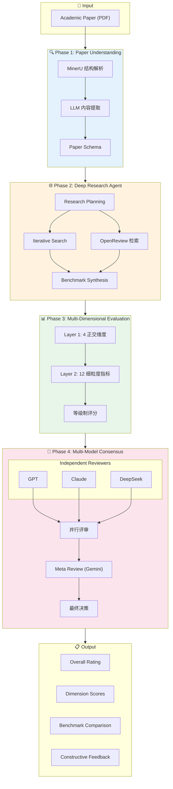
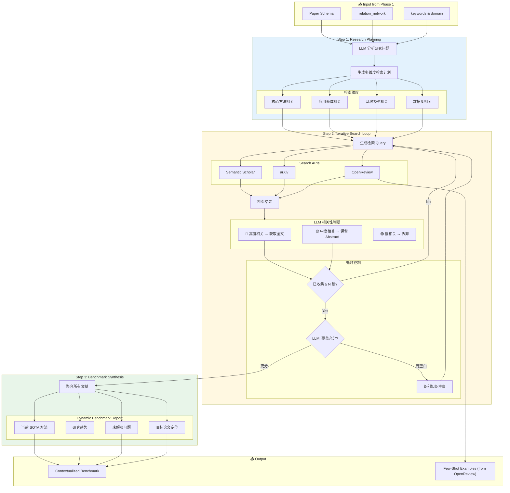
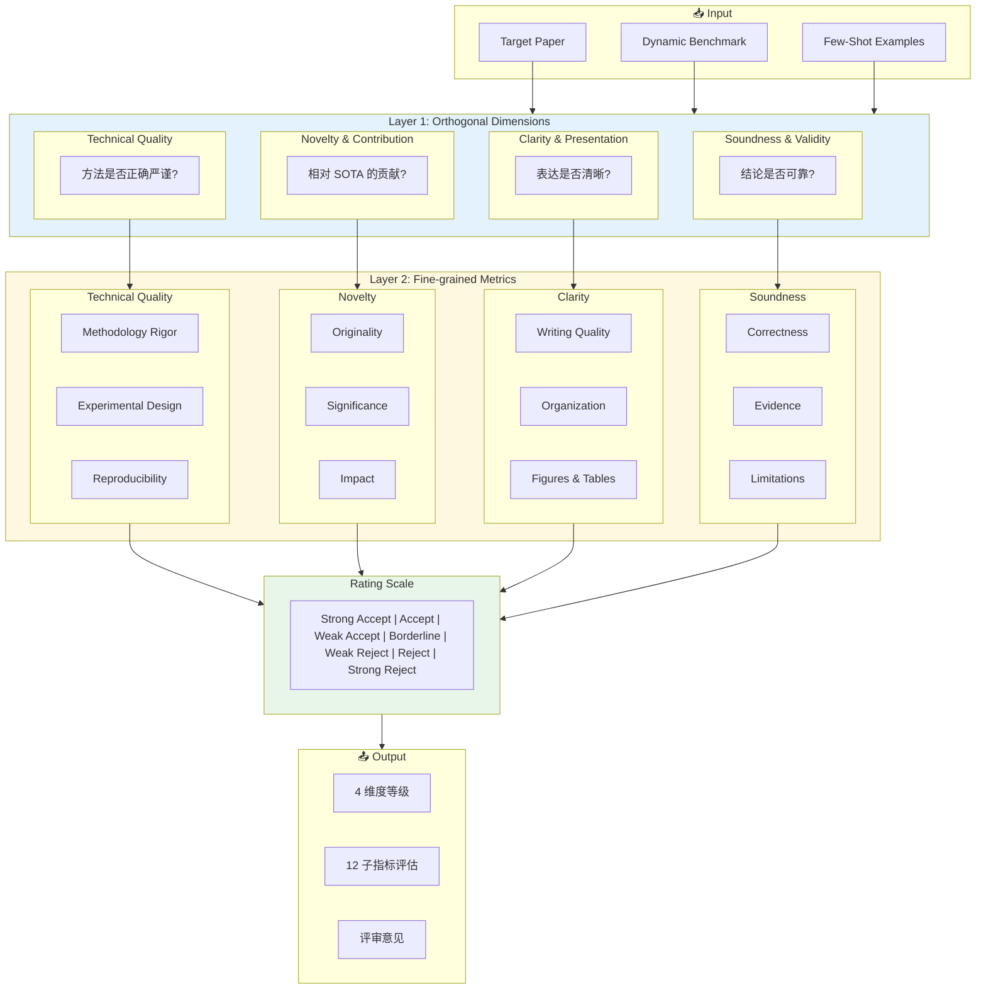
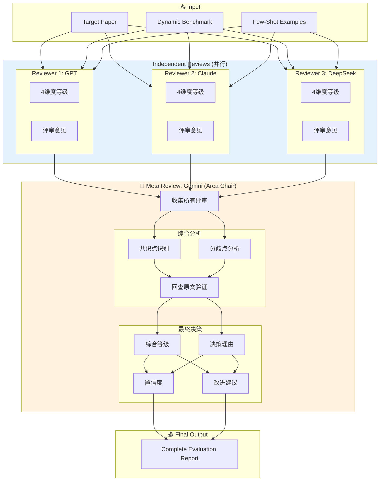

# HorizonBench 项目知识库

> 最后更新: 2025年12月6日

---

## 一、项目基本信息

| 项目             | 详情                                                         |
| ---------------- | ------------------------------------------------------------ |
| **系统名称**     | HorizonBench                                                 |
| **课程**         | JC4003: Natural Language Processing                          |
| **任务**         | 设计一个基于LLM的学术论文自动评分与反馈系统（Design Report） |
| **完成方式**     | 单人完成                                                     |
| **报告模板**     | NeurIPS 格式                                                 |
| **参考文献格式** | 不需要特别考虑                                               |
| **页数限制**     | 无硬性限制（建议约 12-14 页正文）                            |
| **截止日期**     | 2025年12月12日 22:00 (UTC+8)                                 |
| **权重**         | 占期末成绩 25%                                               |
| **提交形式**     | 单个 PDF 文档，通过 Blackboard 提交                          |

---

## 二、论文结构与图表安排

### 2.1 整体结构

| 部分                          | 权重 | 内容              | 篇幅建议      | 图表安排          |
| ----------------------------- | ---- | ----------------- | ------------- | ----------------- |
| **Part A: The Vision**        | 15%  | 摘要 + 引言与动机 | ~250词 + ~1页 | 无                |
| **Part B: The Foundation**    | 25%  | 文献综述          | 2-3页         | 可选1张演进图     |
| **Part C: The Blueprint**     | 30%  | 系统架构与设计    | 4-5页         | **4-5张核心图**   |
| **Part D: The Validation**    | 20%  | 创新点 + 评估计划 | ~1页 + 2页    | 可选1张评估流程图 |
| **Part E: The Reality Check** | 10%  | 伦理考量 + 时间线 | ~1页 + 甘特图 | 1张甘特图         |

### 2.2 Part C 图表安排（核心）

| 图表编号     | 内容                     | 对应章节                 | 优先级   |
| ------------ | ------------------------ | ------------------------ | -------- |
| **Figure 1** | HorizonBench 系统总览图  | 4.1 Overall Architecture | ⭐⭐⭐ 必须 |
| **Figure 2** | Deep Research Agent 流程 | 4.2 Data Pipeline        | ⭐⭐⭐ 必须 |
| **Figure 3** | 评估维度结构图           | 4.4 Prompt Engineering   | ⭐⭐⭐ 必须 |
| **Figure 4** | 多模型共识机制           | 4.3 Core Model           | ⭐⭐ 重要  |
| **Figure 5** | 输出报告结构             | 4.5 Output and UI        | ⭐⭐ 重要  |

---

## 三、系统设计方案 (Method)

### 3.1 设计理念

HorizonBench 的核心设计理念是**模拟真实顶会评审流程**：

| 真实顶会流程      | HorizonBench 对应                         |
| ----------------- | ----------------------------------------- |
| Reviewer 1-3      | GPT-5 / Claude 4.5 Sonnet / DeepSeek-V3.2 |
| Individual Review | 独立等级评审 + 文字反馈                   |
| Discussion        | 模型间交叉验证（可选）                    |
| Area Chair        | Meta Review Agent (Gemini 3.0)            |
| Final Decision    | 综合评级 + 置信度                         |

**三大核心创新**：
1. **Dynamic Benchmark**: 为每篇论文动态构建领域前沿基准
2. **OpenReview Integration**: 利用真实评审数据（含 Rejected）
3. **等级制 + Meta Review**: 解决 LLM 数字敏感性，提高评审可靠性

---

### 3.2 四阶段流程概述

| Phase       | 名称                         | 核心任务                    | 输出              |
| ----------- | ---------------------------- | --------------------------- | ----------------- |
| **Phase 1** | Paper Understanding          | PDF解析 → 内容提取 → 结构化 | Paper Schema      |
| **Phase 2** | Deep Research Agent          | 动态构建领域基准            | Dynamic Benchmark |
| **Phase 3** | Multi-Dimensional Evaluation | 4正交维度 + 12细粒度指标    | Dimension Ratings |
| **Phase 4** | Multi-Model Consensus        | 3 Reviewer + Meta Review    | Final Report      |

---

### 3.3 Figure 1: 系统总览图



---

### 3.4 Phase 1: Paper Understanding

#### 3.4.1 技术选型

| 组件         | 选择               | 理由                                             |
| ------------ | ------------------ | ------------------------------------------------ |
| **PDF 解析** | MinerU (Magic-PDF) | 开源界解析学术论文最强，完美还原双栏、公式、表格 |
| **内容提取** | LLM (GPT/Claude)   | 语义理解必须依赖 LLM                             |
| **验证机制** | 按需 LLM 补充      | 仅当关键字段缺失时触发                           |

#### 3.4.2 处理流程

```
PDF → MinerU 解析 → Structured Markdown → LLM 内容提取 → 字段验证 → Paper Schema
```

#### 3.4.3 Output Schema

```json
{
  "paper_metadata": {
    "title": "论文标题",
    "authors": ["作者列表"],
    "venue": "发表会议/期刊",
    "year": 2024
  },
  
  "content_understanding": {
    "abstract": "摘要全文",
    "research_problem": "研究问题/动机",
    "methodology": "方法概述",
    "contributions": ["贡献点1", "贡献点2"],
    "conclusions": "主要结论",
    "limitations": "作者自述的局限性"
  },
  
  "classification": {
    "domain": "所属领域 (如 NLP, CV, ML)",
    "sub_domain": "子领域",
    "paper_type": "论文类型 (empirical/theoretical/survey/resource)",
    "keywords": ["关键词1", "关键词2"]
  },
  
  "relation_network": {
    "baselines_compared": [
      {"name": "模型名", "context": "对比场景"}
    ],
    "datasets_benchmarks": [
      {"name": "数据集名", "usage": "使用方式"}
    ],
    "seminal_references": [
      {"title": "论文标题", "relevance": "相关性说明"}
    ]
  }
}
```

**relation_network 设计理由**：支持 Agent 进行"滚雪球"式的文献调研，不仅提取内容，更提取"关系网络"。

---

### 3.5 Phase 2: Deep Research Agent

#### 3.5.1 设计理念

借鉴 Deep Research Agent 的设计，让 LLM 自主决定检索策略和终止时机：

| 决策点       | 传统方法   | HorizonBench Agentic 方法 |
| ------------ | ---------- | ------------------------- |
| 检索关键词   | 固定提取   | LLM 动态生成多轮查询      |
| 返回论文数量 | 固定 Top-K | LLM 判断"够了"才停止      |
| 检索深度     | 单轮检索   | 多轮迭代，逐步细化        |
| 相关性判断   | 规则/阈值  | LLM 自主判断              |

#### 3.5.2 技术选型

| 决策点   | 选择                                    |
| -------- | --------------------------------------- |
| 检索 API | **Semantic Scholar (主) + arXiv (辅)**  |
| 终止条件 | **最少 N 篇 + LLM 判断是否继续**        |
| 结果处理 | **默认读 Abstract，高度相关时获取全文** |

#### 3.5.3 OpenReview 数据集成

**数据覆盖范围**：
- ICLR（最完整的 OpenReview 数据）
- NeurIPS（部分年份）
- ICML（部分年份）
- ACL ARR（新系统，数据在积累中）

**可获取数据**：
- 真实 Reviewer 评审文本
- 评分 & 等级
- 作者 Rebuttal
- Accept/Reject 决定

**特殊价值**：Rejected 论文的评审数据极其珍贵，帮助模型理解"边界"。

#### 3.5.4 Figure 2: Deep Research Agent 流程



#### 3.5.5 特殊情况处理

**检索结果稀少的处理**：
- 如果 Agent 努力检索后仍找不到高度相关论文
- 说明这是新兴/交叉领域，论文方法/问题确实新颖
- 标记为"高创新性"，在 Novelty 维度酌情加分

---

### 3.6 Phase 3: Multi-Dimensional Evaluation

#### 3.6.1 评分制度：等级制

**设计理由**：
1. LLM 对数字敏感，重复运行可能每次分数不同
2. 等级制更稳定，与真实顶会评审制度一致
3. 等级背后映射数值，仅用于最终聚合计算

| 等级          | 含义                       | 映射值 |
| ------------- | -------------------------- | ------ |
| Strong Accept | 显著超越 SOTA，重大贡献    | 10     |
| Accept        | 达到顶会水平，有明确贡献   | 8      |
| Weak Accept   | 基本达标，贡献有限但可接受 | 6      |
| Borderline    | 边缘水平，需要改进         | 5      |
| Weak Reject   | 低于标准，存在明显问题     | 4      |
| Reject        | 不达标，需要大幅修改       | 3      |
| Strong Reject | 严重缺陷，不适合发表       | 1      |

*注：映射值仅用于内部聚合，不直接展示给 LLM*

#### 3.6.2 两层评估结构

**Layer 1: 4 个正交维度**

| 维度                       | 评估焦点             | 参照基准                     | 与其他维度的区分               |
| -------------------------- | -------------------- | ---------------------------- | ------------------------------ |
| **Technical Quality**      | 方法是否正确、严谨   | Benchmark 方法论标准         | 不管写得好不好、不管是否新颖   |
| **Novelty & Contribution** | 相对 SOTA 的增量贡献 | Benchmark 已有工作           | 不管方法是否完美、不管表达如何 |
| **Clarity & Presentation** | 表达是否清晰易懂     | 绝对标准（不需要 Benchmark） | 不管内容本身对错、不管是否创新 |
| **Soundness & Validity**   | 结论是否有充分支撑   | Benchmark 实验规范           | 不管方法多复杂、不管表达多优美 |

**正交性原则**：第一层各维度独立评分，互不影响。一篇论文可以是"方法新颖但写得很差"或"写得清楚但结论不可靠"。

**Layer 2: 12 个细粒度指标**

| 维度                   | 子指标                                                                  |
| ---------------------- | ----------------------------------------------------------------------- |
| Technical Quality      | Methodology Rigor, Experimental Design, Reproducibility                 |
| Novelty & Contribution | Originality of Ideas, Significance of Contribution, Potential Impact    |
| Clarity & Presentation | Writing Quality, Organization & Structure, Figures & Tables Quality     |
| Soundness & Validity   | Correctness of Claims, Adequacy of Evidence, Limitations Acknowledgment |

#### 3.6.3 Figure 3: 评估维度结构图



---

### 3.7 Phase 4: Multi-Model Consensus + Meta Review

#### 3.7.1 模型分工

| 角色               | 模型              | 说明                                 | 引用                        |
| ------------------ | ----------------- | ------------------------------------ | --------------------------- |
| Reviewer 1         | GPT-5             | OpenAI 最新旗舰，强推理+多模态       | openai2025gpt5              |
| Reviewer 2         | Claude 4.5 Sonnet | Anthropic 最强，精细分析+指令遵循    | anthropic2025claude45sonnet |
| Reviewer 3         | DeepSeek-V3.2     | DeepSeek 最新，高性价比+学术文本理解 | deepseekai2025deepseekv32   |
| Meta Reviewer (AC) | Gemini 3.0        | Google 最新，快速独立综合            | google2025gemini3           |

**设计亮点**：Meta Review 使用独立于三个 Reviewer 的第四家模型，避免"自己评审自己"的偏见。

#### 3.7.2 多模型策略

采用**方案 A: 并行评估 + 聚合**：
- 三个模型独立评分
- 各自输出等级 + 评审意见
- Meta Review (Gemini) 综合决策

#### 3.7.3 Few-Shot 示例策略

**来源优先级**：
1. OpenReview 真实评审（最优）
2. PeerRead 数据集（备选）

**示例数量**：2-4 个

**理想组合**：
- 1-2 个 Accepted（Strong Accept + Accept）
- 1-2 个 Rejected（含拒稿理由）
- 让模型理解"边界"在哪里

#### 3.7.4 Meta Review 机制

Meta Review Agent (Gemini) 的任务：
1. **收集**：汇总三份独立评审
2. **分析**：识别共识点和分歧点
3. **验证**：回查原文解决分歧
4. **决策**：给出最终评级和理由

#### 3.7.5 Figure 4: 多模型共识机制



#### 3.7.6 置信度计算

| 因素                 | 规则                                                   |
| -------------------- | ------------------------------------------------------ |
| **Reviewer 一致性**  | 3/3 一致 → High; 2/3 一致 → Medium; 都不同 → Low       |
| **Benchmark 覆盖度** | ≥10篇相关论文 → 加分; <5篇 → 降低置信度                |
| **Few-Shot 匹配度**  | 有同领域 OpenReview 真实评审 → 加分; 仅通用示例 → 中等 |

---

### 3.8 Figure 5: 输出报告结构

```mermaid
flowchart TB
    subgraph Report["📋 HorizonBench Evaluation Report"]
        subgraph Header["报告头部"]
            Title["论文标题 & 元信息"]
            OverallRating["🎯 Overall: Accept"]
            Confidence["Confidence: High"]
        end
        
        subgraph DimScores["维度评分"]
            DS1["Technical Quality: Accept"]
            DS2["Novelty: Strong Accept"]
            DS3["Clarity: Accept"]
            DS4["Soundness: Weak Accept"]
        end
        
        subgraph BenchmarkContext["📊 Benchmark Context"]
            BC1["相关论文: 15 篇"]
            BC2["SOTA: XXX (2024)"]
            BC3["本文定位: 在 YYY 超越 SOTA"]
        end
        
        subgraph ReviewerSummary["👥 Reviewer Summary"]
            RS1["GPT: Accept"]
            RS2["Claude: Accept"]
            RS3["DeepSeek: Weak Accept"]
        end
        
        subgraph MetaSection["🎯 Meta Review"]
            MR1["共识点"]
            MR2["分歧处理"]
            MR3["决策依据"]
        end
        
        subgraph Feedback["💡 Feedback"]
            Strengths["✅ 主要优点"]
            Weaknesses["⚠️ 主要问题"]
            Suggestions["📝 改进建议"]
        end
    end

    Header --> DimScores --> BenchmarkContext --> ReviewerSummary --> MetaSection --> Feedback

    style Header fill:#e8f5e9
    style DimScores fill:#e3f2fd
    style MetaSection fill:#fff3e0
    style Feedback fill:#fce4ec
```



---

## 四、数据策略

### 4.1 数据来源

| 用途         | 数据源                   | 说明                         |
| ------------ | ------------------------ | ---------------------------- |
| **系统输入** | ACL Anthology            | 论文 PDF                     |
| **文献检索** | Semantic Scholar + arXiv | Phase 2 动态检索             |
| **真实评审** | OpenReview               | Few-Shot 示例（含 Rejected） |
| **评估验证** | PeerRead                 | 14.7K 论文 + 10.7K 评审      |

### 4.2 PeerRead 数据集

| 项目            | 详情                                                 |
| --------------- | ---------------------------------------------------- |
| **来源**        | Allen AI (allenai)                                   |
| **GitHub**      | https://github.com/allenai/PeerRead                  |
| **HuggingFace** | https://huggingface.co/datasets/allenai/peer_read    |
| **内容**        | 14.7K 论文草稿 + accept/reject 决定 + 10.7K 专家评审 |
| **会议覆盖**    | ACL, NIPS, ICLR                                      |
| **评分维度**    | originality, impact, clarity, soundness 等           |

### 4.3 ACL Anthology 2023-2025 数据集

| 项目     | 详情                                       |
| -------- | ------------------------------------------ |
| **来源** | ACL Anthology                              |
| **官网** | https://aclanthology.org                   |
| **内容** | 完整论文 PDF + 元数据 (标题、作者、摘要等) |

**年份覆盖与论文数量**:

| 年份     | 会议                              | 论文数量 (约) |
| -------- | --------------------------------- | ------------- |
| **2023** | ACL, EMNLP, NAACL, EACL, Findings | ~4,500 篇     |
| **2024** | ACL, EMNLP, NAACL, EACL, Findings | ~5,200 篇     |
| **2025** | ACL (预计), ARR submissions       | 持续更新中    |

**数据获取方式**:
- **批量下载**: 通过 ACL Anthology GitHub 仓库获取元数据
- **PDF 链接**: 直接从 aclanthology.org 下载论文 PDF

**特点**:
- ✅ NLP 领域最权威的论文集合
- ✅ 包含主会议 + Findings + Workshop 论文
- ✅ 结构化元数据 (BibTeX 格式)
- ✅ 免费开放获取

### 4.4 OpenReview 数据覆盖

| 会议    | 数据完整度 |
| ------- | ---------- |
| ICLR    | ✅ 完整     |
| NeurIPS | ⚠️ 部分年份 |
| ICML    | ⚠️ 部分年份 |
| ACL ARR | 🔄 积累中   |

---

## 五、核心创新点总结

| 创新点                     | 说明                                                | 解决的问题               |
| -------------------------- | --------------------------------------------------- | ------------------------ |
| **Dynamic Benchmark**      | 基于 Deep Research Agent 为每篇论文动态构建领域基准 | 静态标准无法适应不同领域 |
| **OpenReview Integration** | 利用真实评审数据（含 Rejected）作为 Few-Shot        | 缺乏真实评审参照         |
| **等级制评分**             | 使用等级而非数值，解决 LLM 数字敏感性               | LLM 重复运行分数不稳定   |
| **Meta Review 机制**       | 独立模型 (Gemini) 作为 Area Chair                   | 单模型评审可靠性不足     |
| **检索稀少 = 创新性强**    | 巧妙处理新兴/交叉领域论文                           | 新领域无法公平评估       |
| **模拟顶会流程**           | 完整还原 Reviewer → AC 的评审链路                   | 与真实评审脱节           |

---

## 六、参考资源

### 论文
- AutoPeer (JC4003 Group 6): 参考设计思路
- PeerRead (Kang et al., NAACL 2018): 数据集论文

### 数据集
- PeerRead: https://github.com/allenai/PeerRead
- ACL Anthology: https://aclanthology.org/
- OpenReview: https://openreview.net/

### 工具
- MinerU (Magic-PDF): PDF 解析
- Semantic Scholar API: 文献检索
- arXiv API: 预印本检索

---

*文档结束*