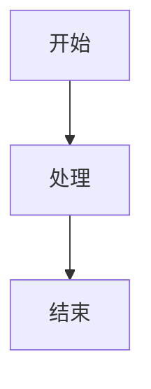

# 📊 图表文件夹使用说明

## 🎨 方案3：在线生成图片 (推荐)

### 1. 在线生成Mermaid图表
访问：https://mermaid.live

### 2. 粘贴你的Mermaid代码
例如：


### 3. 导出为PNG或SVG
- 点击 "Actions" → "Download PNG" 或 "Download SVG"
- 保存到此 `Fig/` 文件夹

### 4. 在LaTeX中引用
```latex
\begin{figure}[htbp]
\centering
\includegraphics[width=0.8\textwidth]{Fig/your_diagram.png}
\caption{你的图表标题}
\label{fig:your-diagram}
\end{figure}
```

## 📁 文件组织
```
Fig/
├── README.md           # 此说明文件
├── diagram1.png        # 你的图表文件
├── diagram2.svg        # SVG格式图表
└── .gitkeep           # 保持文件夹结构
```

## 💡 优势
- ✅ 简单易用，无需安装任何软件
- ✅ 实时预览Mermaid效果
- ✅ 支持所有Mermaid图表类型
- ✅ 高质量输出，适合学术论文
- ✅ 跨平台，在任何地方都能使用

---
*推荐使用PNG格式，兼容性最好*