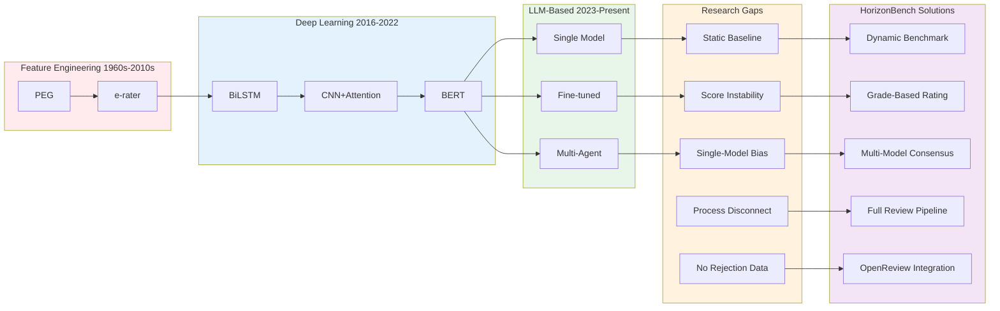
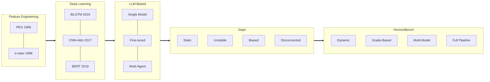
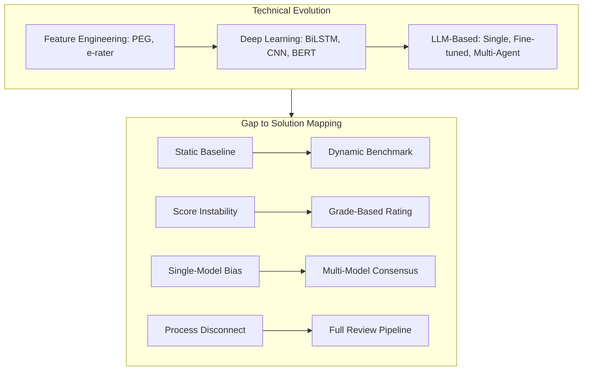

# Part B: Literature Review Taxonomy (Revised)

## Figure: Evolution of Automated Academic Assessment

```mermaid
flowchart LR
    subgraph Era1["Feature Engineering 1960s-2010s"]
        A1["PEG"]
        A2["e-rater"]
    end
    
    subgraph Era2["Deep Learning 2016-2022"]
        B1["BiLSTM"]
        B2["CNN+Attention"]
        B3["BERT"]
    end
    
    subgraph Era3["LLM-Based 2023-Present"]
        C1["Single Model"]
        C2["Fine-tuned"]
        C3["Multi-Agent"]
    end
    
    subgraph Gaps["Research Gaps"]
        G1["Static Baseline"]
        G2["Score Instability"]
        G3["Single-Model Bias"]
        G4["Process Disconnect"]
        G5["No Rejection Data"]
    end
    
    subgraph HB["HorizonBench Solutions"]
        H1["Dynamic Benchmark"]
        H2["Grade-Based Rating"]
        H3["Multi-Model Consensus"]
        H4["Full Review Pipeline"]
        H5["OpenReview Integration"]
    end
    
    A1 --> A2
    A2 --> B1
    B1 --> B2
    B2 --> B3
    B3 --> C1
    B3 --> C2
    B3 --> C3
    C1 --> G1
    C2 --> G2
    C3 --> G3
    G1 --> H1
    G2 --> H2
    G3 --> H3
    G4 --> H4
    G5 --> H5
    
    style Era1 fill:#ffebee
    style Era2 fill:#e3f2fd
    style Era3 fill:#e8f5e9
    style Gaps fill:#fff3e0
    style HB fill:#f3e5f5
```

## Alternative: Cleaner Flow

```mermaid
flowchart LR
    subgraph E1["Feature Engineering"]
        direction TB
        A1["PEG 1966"]
        A2["e-rater 1998"]
        A1 --- A2
    end
    
    subgraph E2["Deep Learning"]
        direction TB
        B1["BiLSTM 2016"]
        B2["CNN+Attn 2017"]
        B3["BERT 2019"]
        B1 --- B2 --- B3
    end
    
    subgraph E3["LLM-Based"]
        direction TB
        C1["Single Model"]
        C2["Fine-tuned"]
        C3["Multi-Agent"]
        C1 --- C2 --- C3
    end
    
    subgraph G["Gaps"]
        direction TB
        G1["Static"]
        G2["Unstable"]
        G3["Biased"]
        G4["Disconnected"]
    end
    
    subgraph H["HorizonBench"]
        direction TB
        H1["Dynamic"]
        H2["Grade-Based"]
        H3["Multi-Model"]
        H4["Full Pipeline"]
    end
    
    E1 ==> E2 ==> E3 ==> G ==> H
```

## Alternative: Two-Row Layout

```mermaid
flowchart TB
    subgraph Top["Technical Evolution"]
        direction LR
        E1["Feature Engineering: PEG, e-rater"] --> E2["Deep Learning: BiLSTM, CNN, BERT"] --> E3["LLM-Based: Single, Fine-tuned, Multi-Agent"]
    end
    
    subgraph Bottom["Gap to Solution Mapping"]
        direction LR
        G1["Static Baseline"] --> H1["Dynamic Benchmark"]
        G2["Score Instability"] --> H2["Grade-Based Rating"]
        G3["Single-Model Bias"] --> H3["Multi-Model Consensus"]
        G4["Process Disconnect"] --> H4["Full Review Pipeline"]
    end
    
    Top --> Bottom
```
