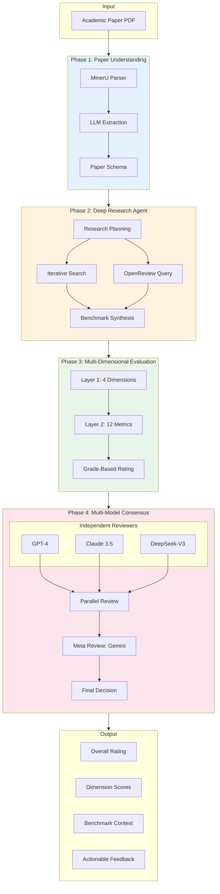
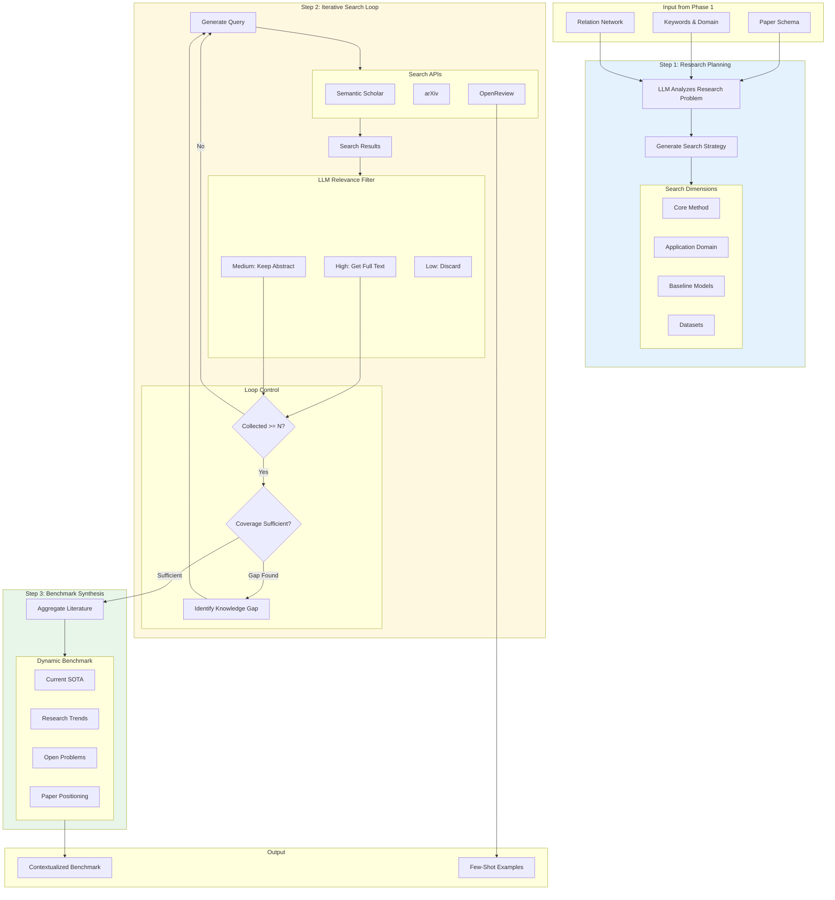
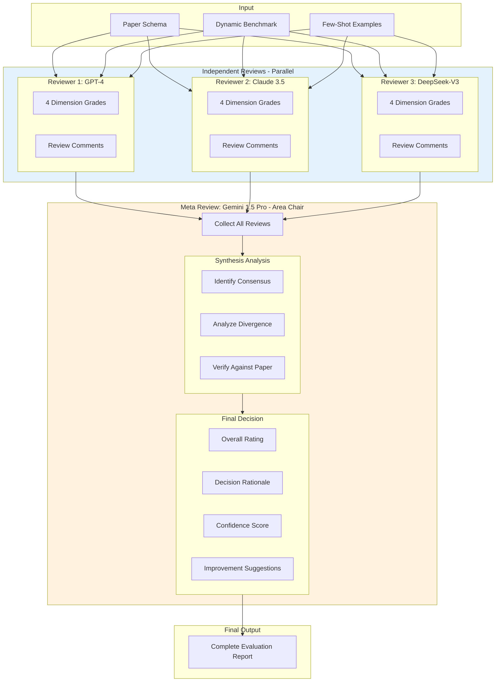
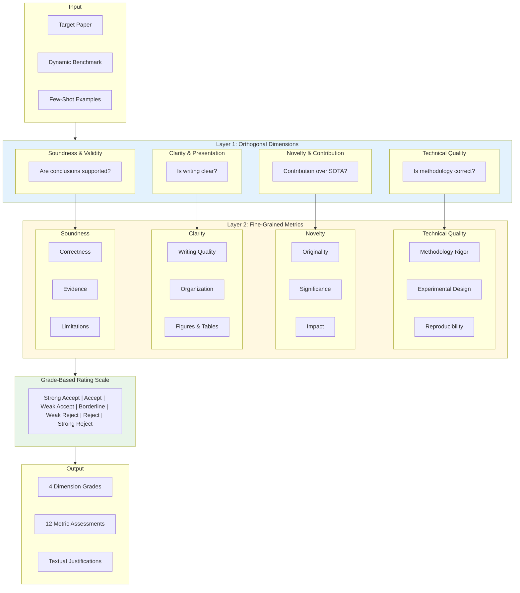

# HorizonBench Part C: Mermaid Diagrams

> 将每个代码块分别转换为 PNG，文件名见标题

---

## Figure 2: system_overview.png

---

## Figure 3: paper_understanding.png

```mermaid
flowchart LR
    subgraph Input["Input"]
        PDF["PDF Document"]
    end

    subgraph Parsing["Structural Parsing"]
        MinerU["MinerU Engine"]
        subgraph Preserved["Preserved Elements"]
            Dual["Dual-Column Layout"]
            Math["Mathematical Formulas"]
            Table["Tables & Figures"]
        end
        MinerU --> Preserved
    end

    subgraph Extraction["Semantic Extraction"]
        MD["Structured Markdown"]
        LLM["LLM Extractor"]
        subgraph Fields["Extracted Fields"]
            Meta["Metadata"]
            Content["Content Understanding"]
            Class["Classification"]
            Relation["Relation Network"]
        end
        MD --> LLM --> Fields
    end

    subgraph Validation["Validation"]
        Check{"Fields Complete?"}
        Retry["LLM Retry"]
        Schema["Paper Schema"]
        Check -->|No| Retry
        Retry --> Check
        Check -->|Yes| Schema
    end

    PDF --> MinerU
    Preserved --> MD
    Fields --> Check

    style Parsing fill:#e3f2fd
    style Extraction fill:#fff3e0
    style Validation fill:#e8f5e9
```

---

## Figure 4: deep_research.png

---

## Figure 5: multi_model.png

---

## Figure 6: evaluation_dims.png

---

## Figure 7: output_report.png

```mermaid
flowchart TB
    subgraph Report["HorizonBench Evaluation Report"]
        subgraph Header["Section 1: Header"]
            Title["Paper Title & Metadata"]
            Overall["Overall Rating: Accept"]
            Conf["Confidence: High"]
        end
        
        subgraph DimScores["Section 2: Dimension Scores"]
            DS1["Technical Quality: Accept"]
            DS2["Novelty: Strong Accept"]
            DS3["Clarity: Accept"]
            DS4["Soundness: Weak Accept"]
        end
        
        subgraph BenchmarkCtx["Section 3: Benchmark Context"]
            BC1["Related Papers: 15"]
            BC2["Current SOTA: Method X"]
            BC3["Positioning: Exceeds in Y"]
        end
        
        subgraph ReviewerSum["Section 4: Reviewer Summary"]
            RS1["GPT-4: Accept"]
            RS2["Claude: Accept"]
            RS3["DeepSeek: Weak Accept"]
        end
        
        subgraph MetaSec["Section 5: Meta Review"]
            MR1["Consensus Points"]
            MR2["Divergence Resolution"]
            MR3["Decision Rationale"]
        end
        
        subgraph Feedback["Section 6: Feedback"]
            Strengths["Strengths"]
            Weaknesses["Weaknesses"]
            Suggestions["Improvement Suggestions"]
        end
    end

    Header --> DimScores --> BenchmarkCtx --> ReviewerSum --> MetaSec --> Feedback

    style Header fill:#e8f5e9
    style DimScores fill:#e3f2fd
    style BenchmarkCtx fill:#fff3e0
    style MetaSec fill:#fce4ec
    style Feedback fill:#f3e5f5
```

---

## 图片命名对照表

| Figure | Mermaid 代码块 | 输出文件名 |
|--------|---------------|-----------|
| Figure 2 | system_overview | `system_overview.png` |
| Figure 3 | paper_understanding | `paper_understanding.png` |
| Figure 4 | deep_research | `deep_research.png` |
| Figure 5 | multi_model | `multi_model.png` |
| Figure 6 | evaluation_dims | `evaluation_dims.png` |
| Figure 7 | output_report | `output_report.png` |

**放置路径**: `figures/` 目录下
